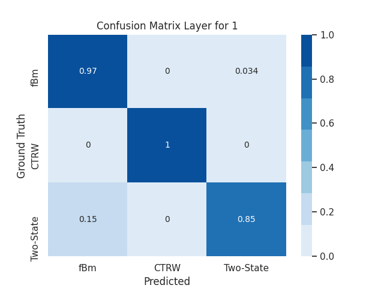

# Diffusion processes classification with Deep Learning 

First network: Fractional Brownian Motion, 2-State Diffusion and CTRW

Second Network: Sub-diffusive, Brownian and Super-diffusive 
* Sub-diffusive: Hurst exponent < 0.5
* Brownian: Hurst exponent = 0.5
* Super-diffusive: Hurst exponent > 0.5

Simulations and models adapted to STORM(Stochastic Optical Reconstruction Microscopy) data.
Raw data is extracted from experimental observations, a pre-processing with ThunderSTORM and Jaqaman allows to obtain data localization and tracks reconstruction. 
Mongo DB is used to store experimental data, trained models and simulated data.
The development of a state-detection network is under consideration to analyze the diffusion coefficients for each state with a traditional approach or using neural networks.

Current accuracy for the first network is:

